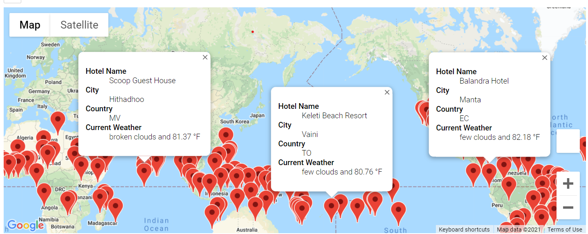
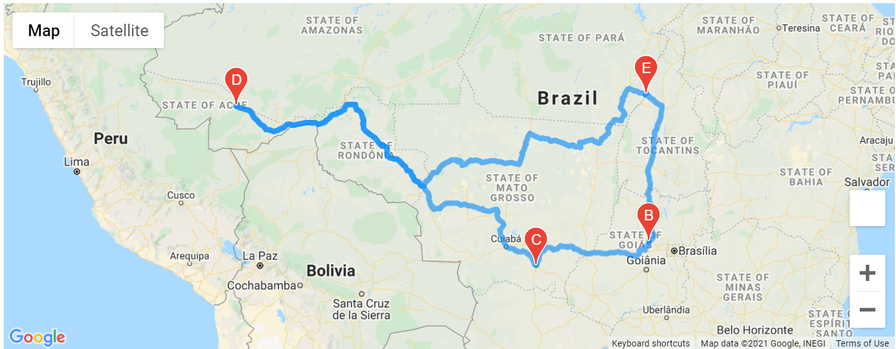
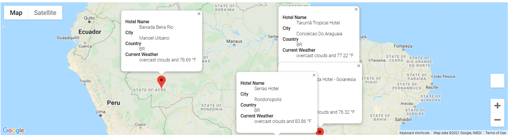

# World Weather Analysis
## Overview of the project
Planmytrip is a top travel technology company that specializes in internet-related services in the hotel and lodging industry. We have been working for an app that presents data for customers via a search page based on their preferred travel criteria to find their ideal hotel anywhere in the world. 

Beta testers recommended a few changes to take the app to the next level. In this project, we will do the following tasks:

1. Retrieve Weather Data
2. Create a Customer Travel Destinations Map
3. Create a Travel Itinerary Map

## Resources
- Data Source: OpenWeatherMap, Google Maps
- Software: Python 3.7.10, Jupyter Notebook

## Outcomes

### 1. Retrieve Weather Data
We retrieved weather data from OpenWeatherMap and saved it as [WeatherPy_Database.csv](https://github.com/Takomochi/World_Weather_Analysis/blob/main/Weather_Database/WeatherPy_Database.csv). 
The notebook for this task is located [here](https://github.com/Takomochi/World_Weather_Analysis/blob/main/Weather_Database/Weather_Database.ipynb). 

### 2. Create a Customer Travel Destinations Map
The search page lets customers filter their preferred temperature of destinations. Then, it will show all the information (Hotel Name, City, Country, Current Weather, and Max temperature)
for each destination like the image below.

The notebook for this task is located [here](https://github.com/Takomochi/World_Weather_Analysis/blob/main/Vacation_Search/Vacation_Search.ipynb).

### 3. Create a Travel Itinerary Map
We used the Google Directions API to create a travel itinerary that shows the route between four cities chosen from the customer’s possible travel destinations. 

We chose four cities and extract latitude-longitude pairs from each city DataFrame. Here is the image of the itenerary.

Next, created a DataFrame by combining four cities data frames and made a map which shows information(Hotel Name, City, Country, Current Weather, and Max temperature) of each city. This is the image of the map. 

The notebook for the task is located [here](https://github.com/Takomochi/World_Weather_Analysis/blob/main/Vacation_Itinerary/Vacation_Itinerary.ipynb).